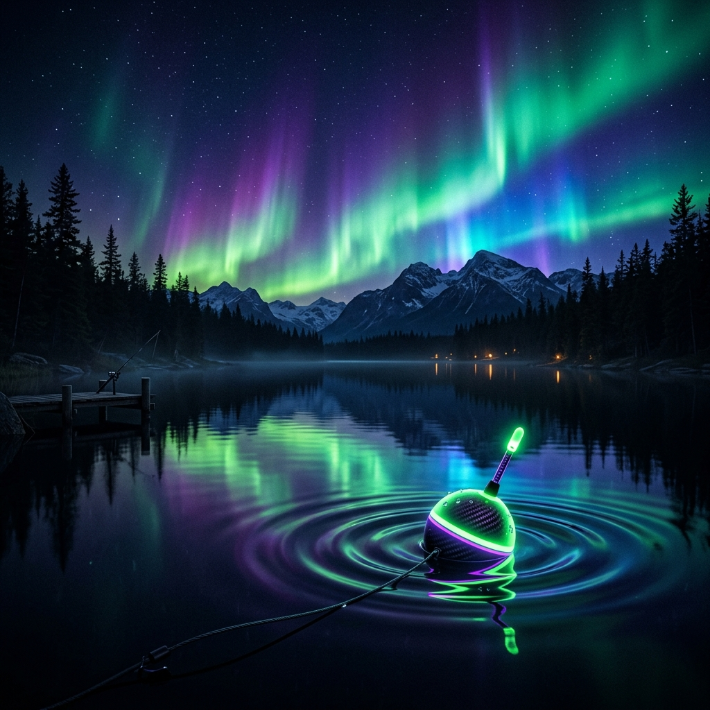

<div align="center">
  

  # 🎣 Peaceful Fishing
  ### *The Ultimate Cinematic Fishing Experience*

  [](https://github.com/chimpk/Peaceful-Fishing/releases)
  [](https://opensource.org/licenses/MIT)
  [](https://vitejs.dev/)

  [**Play Now**](https://chimpk.github.io/Peaceful-Fishing/) • [**Report Bug**](https://github.com/chimpk/Peaceful-Fishing/issues) • [**Request Feature**](https://github.com/chimpk/Peaceful-Fishing/issues)
</div>

<hr />

## 🌟 Overview

**Peaceful Fishing** is not just another fishing game. It's a high-fidelity, skill-based simulation designed to immerse you in the tranquil yet thrilling world of professional angling. Featuring a state-of-the-art cinematic camera system, dynamic weather patterns, and a deep progression loop, every cast is a new adventure.

## ✨ Key Features

### 🎥 Cinematic Camera System
- **Dynamic Zoom**: Experience the tension as the camera zooms in during the `NIBBLING` state, bringing you closer to the action.
- **Visual Drama**: Motion blur and vignette effects during high-tension `REELING` phases simulate the adrenaline of catching a trophy fish.
- **Smooth Transitions**: Fluid camera movements that ensure you never lose sight of your catch.

### 🌤️ Dynamic Weather & Environment
- **Atmospheric Events**: Experience rare phenomena like **Meteor Showers**, **Auroras**, and **Rainbows**, each affecting gameplay and aesthetics.
- **Challenging Conditions**: Navigate through thick **Fog** and battle **Dynamic Currents** that test your precision and reel control.

### 🎣 Advanced Gameplay Mechanics
- **Berserk Mode**: High-stakes struggle mechanics for elite fish species—master the reel as the fish fights back with everything it has.
- **Miracle Save**: A skill-based mechanic that gives you a second chance to land a massive catch, even with basic gear.
- **Gear Maintenance**: A realistic durability system. Keep your rod and tackle in top shape via the integrated repair workshop.

### 💎 Progression & Economy
- **Diverse Fish Species**: From common lake fish to legendary bosses, each with unique models and behaviors.
- **Treasure Chests**: Discover sunken treasures while fishing to upgrade your gear and unlock rare items.

## 🛠️ Tech Stack

- **Core**: [React 19](https://reactjs.org/) & [TypeScript](https://www.typescriptlang.org/)
- **Build Tool**: [Vite 6](https://vite.dev/)
- **Rendering**: HTML5 Canvas with custom Cinematic Pipeline
- **Styling**: Premium CSS Design System

## 🚀 Getting Started

### Prerequisites
- [Node.js](https://nodejs.org/) (v18 or higher)
- [npm](https://www.npmjs.com/)

### Installation

1. **Clone the repository:**
   ```bash
   git clone https://github.com/chimpk/Peaceful-Fishing.git
   cd Peaceful-Fishing
   ```

2. **Install dependencies:**
   ```bash
   npm install
   ```

3. **Set up Environment:**
   Create a `.env.local` file and add your Gemini API Key:
   ```env
   GEMINI_API_KEY=your_api_key_here
   ```

4. **Run Development Server:**
   ```bash
   npm run dev
   ```

## 📜 License

Distributed under the MIT License. See `LICENSE` for more information.

<hr />

<div align="center">
  Built with ❤️ by [chimpk](https://github.com/chimpk)
</div>
